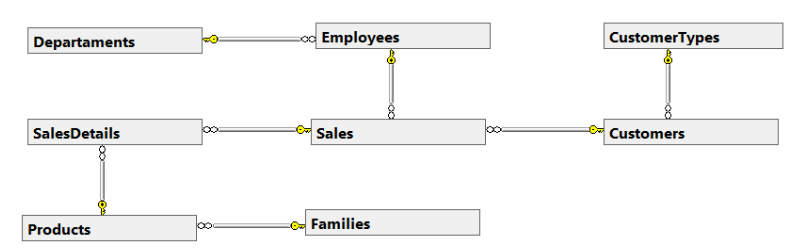
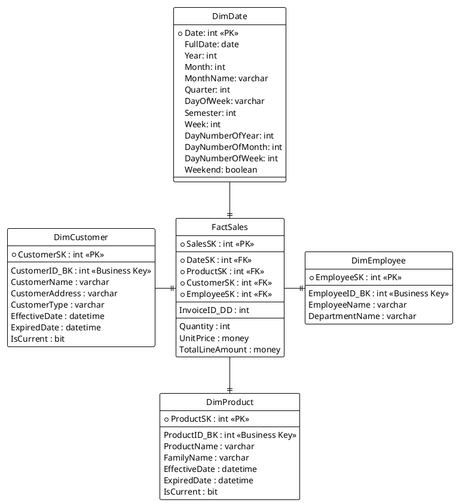

> [!WARNING]
>
> Este repositório serve apenas como bloco de notas pessoal/Second Brain para o desenvolvimento do projeto.

- [ ] **Desenvolver um Data Mart que permita a realização de análises variadas às vendas efetuadas aos clientes.**

# Phase 1

## Kimball Dimensional Modelling

- **Área de Negócio:** Vendas (de produtos musicais)
- **Granularidade:** Uma linha por produto diferente numa fatura.
- **Dimensões:** DimDate; DimCustomer; DimEmployee; DimProduct;
- **Factos:** Quantity; UnitPrice; TotalLineAmount;

# Phase 2

~~Assumindo que a base de dados disponibilizada pelo professor pode ser utilizada como a Staging Area~~ Utilizando a BD disponibilizada como a fonte de dados (e sem os alterar), estou a criar os scripts de criação das tabelas SQL para a Staging Area para seguir o tutorial do [Exercício 2](https://moodle.diogo.wtf/Base%20de%20Dados%20e%20Armaz%C3%A9m%20de%20Dados%2F11%20-%20Semana%20de%2024%20Nov%20a%2028%20Nov%2FExercise%202.zip) que, essencialmente automatiza a criação de uma BD Staging e corre $N$ scripts SQL que estão numa [pasta](DataMart/SQLScripts/Staging) para criar as tabelas da Staging Area. (...)

# Phase 3

Utilizando o modelo dimensional criado na Fase 1, estou a criar os scripts SQL de ETL para popular o Data Mart a partir da Staging Area. Estes scripts estão na [pasta](DataMart/SQLScripts/DataMart) e são executados por um script principal que automatiza o processo de ETL.
