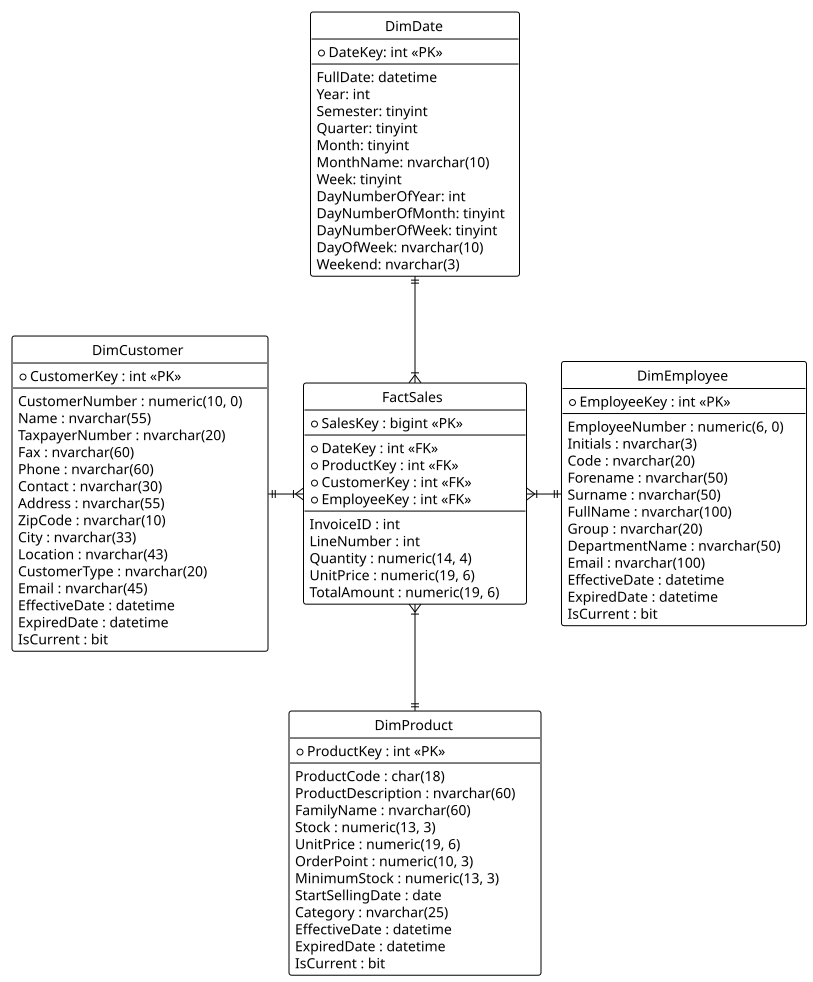
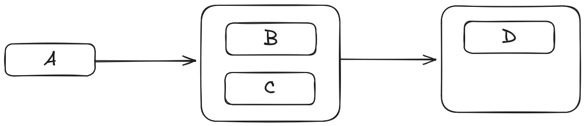

> [!WARNING]
>
> Este repositório serve apenas como bloco de notas pessoal/Second Brain para o desenvolvimento do projeto.

- [ ] **Desenvolver um Data Mart que permita a realização de análises variadas às vendas efetuadas aos clientes.**


# Fase 1

## Modelo Dimensional Kimball

- **Área de Negócio:** Vendas (de produtos musicais)
- **Granularidade:** Uma linha por produto diferente numa fatura.
- **Dimensões:** DimDate; DimCustomer; DimEmployee; DimProduct;
- **Factos:** Quantity; UnitPrice; TotalLineAmount;

## [Modelo Dimensional (Estrela)](assets/dimensions.puml)



# Fase 2

~~Assumindo que a base de dados disponibilizada pelo professor pode ser utilizada como a Staging Area~~ Utilizando a BD disponibilizada como a fonte de dados (e sem os alterar), estou a criar os scripts de criação das tabelas SQL para a Staging Area para seguir o tutorial do [Exercício 2](https://moodle.diogo.wtf/Base%20de%20Dados%20e%20Armaz%C3%A9m%20de%20Dados%2F11%20-%20Semana%20de%2024%20Nov%20a%2028%20Nov%2FExercise%202.zip) que, essencialmente automatiza a criação de uma BD Staging e corre $N$ scripts SQL que estão numa [pasta](SQLScripts/Staging) para criar as tabelas da Staging Area. (...)

# Fase 3

Utilizando o modelo dimensional criado na Fase 1, estou a criar os scripts SQL de ETL para popular o Data Mart a partir da Staging Area. Estes scripts estão na [pasta](SQLScripts/DataMart) e são executados por um script principal que automatiza o processo de ETL.

# Fase 4 (SSIS)

Utilizando o **Visual Studio 2022** e com ajuda do **SQL Server Management Studio** estou a criar um pacote SSIS que automatiza o processo de ETL (Extraction, Transformation e Loading), executando os scripts SQL criados na Fase 3.

~~Atualmente, o pacote cria a BD `Steinway_Staging`, executa os scripts de criação das tabelas e, por fim, "copia" os dados da `Steinway` para a `Steinway_Staging`.
A DB `Steinway_DataMart` e as suas tabelas também são criadas, mas como os dados ainda não sofreram **Transform**, não poderão ser carregados.~~

Seguindo o [Exercício 3](https://moodle.diogo.wtf/Base%20de%20Dados%20e%20Armaz%C3%A9m%20de%20Dados%2F12%20-%20Semana%20de%2001%20Dez%20a%2005%20Dez%2FExercise%203.zip), entende-se que a tabela `DimDate` difere entre as BD's **Staging** e **DataMart**:

> The Date dimension could have been created directly in our DataMart
> database (instead of the Staging Area). However, the Date
> dimension defined for our Data Mart project has different
> needs. It uses much less attributes and some of them are not
> present in the dimension just generated (as you’ll see next).
> From this Date dimension we will create a CSV file and complete
> this file with the attributes that are still missing for our Date
> dimension. In the future, you can use this CSV file in any Data
> Warehouse/Mart project to load the Date dimension table.

Atualmente, o projeto cria a BD `Steinway_Staging`, itera e executa os scripts de criação de tabelas da mesma e "copia" os conteúdos da BD Original. Com o exercício 3, foi criado um **Analysis Services Multidimensional Project** que permite automatizar a criação e inserção da tabela `DimDate` na DB **Staging**.

É criado também um segundo **Integration Services Project** com um único propósito: Ler a tabela `DimDate` da **Staging** para extrair para um ficheiro [`DimDate.csv`](Utils/DimDate.csv).

Após a adição manual de algumas colunas no ficheiro `.csv`, são feitas filtragens e mapeamentos para definir os conteúdos inseridos na `DimDate` da BD **DataMart**.

# Fase 5 (Transformation)

## Início do Exercício 4

Ao iniciar o [exercício 4](https://moodle.diogo.wtf/Base%20de%20Dados%20e%20Armaz%C3%A9m%20de%20Dados%2F13%20-%20Semana%20de%2008%20Dez%20a%2012%20Dez%2FExercise%204.zip), notei que a tabela da BD **Original** `Departaments` se encontrava mal escrita e então passei pelo processo de entender como poderia manipular as variáveis de forma a mudar apenas o nome da base de dados, sem mudar o conteúdo ou afetar a automatização das outras tabelas. A alteração foi bastante simples, mas para isso foi necessário aprender a utilizar a função de **debug** e **breakpoints** do Visual Studio.
Primeiramente, tomei iniciativa de corrigir as ocurrências do nome "Departaments" para "Departments" dentro do [script de criação da tabela](SQLScripts/Staging/CreateTableDepartaments.sql) **e mudar também o nome do ficheiro para haver consistência, o que estava errado**.
No começo do trabalho, eu decidi que o mais correto seria criar os scripts de criação das tabelas com o nome exato das tabelas da BD **Original**, independentemente do contexto.

### Porquê?

Neste projeto, a abordagem para o problema foi usar o nome dos ficheiros como método de extrair os nomes das tabelas da `Steinway`, e a `Steinway_Staging` visaria ter tabelas com esses mesmos nomes.
O impedimento começou aí: A tabela `Steinway.Departaments` criaria erradamente a `Steinway_Staging.Departaments`.

Problema ainda maior:

- Se o nome do ficheiro fosse `CreateTableDepartments.sql`, não seguiria a convenção de ter o nome da BD **original**.
- Se o nome do ficheiro fosse `CreateTableDepartaments.sql`, seguiria a convenção mas:
  - Se os conteúdos da criação da tabela fossem `Departaments`, estaria a continuar o erro da BD **original**.
  - Se os conteúdos da criação da tabela fossem `Departments`, a variável `User::TableName` seria `Departaments` (valor extraído do nome do ficheiro) e a inserção de dados não funcionaria.

### Solução

No container **Foreach Loop** para a inserção de dados, são atribuidos valores através do **Expression Task** que tem a seguinte expressão:

```
"IF EXISTS (SELECT * FROM Steinway.sys.tables WHERE name = '" + @[User::TableName] + "')
 BEGIN
    INSERT INTO [Steinway_Staging].[dbo].[" + REPLACE(@[User::TableName], "Departaments", "Departments") + "]
    SELECT * FROM [Steinway].[dbo].[" + @[User::TableName] + "]
END"
```

Note-se que a variável `User::TableName` é usada várias vezes, mas apenas numa ocurrência se faz um `REPLACE(..., "Departaments", "Departments")`. Isto explica-se da seguinte forma:
Querendo ler a tabela `Steinway.Departaments` e inserir na `Steinway_Staging.Departments`, o valor de `User::TableName` continua a ser o nome da tabela da BD **Original**, então é necessário mudar o valor na tabela de destino.

Explicação visual:

```sql
-- @[User::TableName]                                         = "Departaments"
-- REPLACE(@[User::TableName], "Departaments", "Departments") = "Departments"

IF EXISTS (SELECT * FROM Steinway.sys.tables WHERE name = 'Departaments')
 BEGIN
    INSERT INTO [Steinway_Staging].[dbo].[Departments]
    SELECT * FROM [Steinway].[dbo].[Departaments]
END
```

Durante este processo, reparei também que as tabelas dimensionais estavam bastante incompletas e até mesmo erradas, com menos atributos do que a própria **Staging**. Foram alterados os scripts de criação da **DataMart** para estarem de acordo com a seguinte fórmula:

```sql
numAttrsDimTable >= numAttrsStagingTable + 3
```

Onde o valor 3 da fórmula refere-se ao número de atributos convencionais das tabelas dimensionais:

- `<model>`Key
- EffectiveDate
- ExpiredDate
- ~~isCurrent~~ (`isCurrent` é desnecessário, pois a informação está presente ao analisar a tabela. Se `ExpiredDate == NULL`, indica que é a versão mais recente)

---

## Exercício 4 - Primeira Inserção

Para concretizar a operação presente, achei correto modificar os nomes das **Business Keys** (BK) para `<model_name>ID` para uma maior compreensão dos Modelos.
Seguindo a onda de "otimização superficial", decidi mudar todos os atributos com tipo `nvarchar` para `varchar` para evitar fazer conversões (string -> Unicode string) durante o processo de **Transformation**.

Analisei também as tabelas e os respetivos tipos de dados para definir a nulabilidade dos atributos no Data Mart.

Terminando a operação de **ETL** do `DimCustomer`, passei por bastantes complicações, destacando:

- O operador de condição (ternary) ser muito restrito a comparar valores devido a **Type Castings**.
- Valores que violem a lógica de negócio (tais como `TaxpayerNumber` com o valor `"000000000"`) que obrigam a procurar por valores fixos.
- Lógica de valores **Boolean** em **Expressions**, em que o valor `NULL` é considerado "desconhecido" no SQL e não se avalia como `FALSE`, obrigando a fazer verificações adicionais com `ISNULL()`.

Estes obstáculos fazem com que as verificações necessitem de ser mais trabalhadas para que sejam realmente eficazes.

Para o **Loading** das tabelas dimensionais, achei vantajoso adicionar alguns atributos relativamente às tabelas **Staging**:

| _Tabela Staging_ | _Atributo Adicionado_ |         _Tipo_          |     _Descrição/Utilidade_     |
| :--------------: | :-------------------: | :---------------------: | :---------------------------: |
|    Employees     |       FullName        | `varchar(100) NOT NULL` | Análise de Dados Future-Proof |
|     Products     |   StockLeftToOrder    |    `bigint NOT NULL`    | Análise de Dados Future-Proof |

# Fase 6 - Fact Sales ETL

O processo de **Loading** da **tabela de factos** foi bastante mais direto visto que a arquitetura da implementação do **Projeto/Pacote ETL** já estava pré-definida devido à realização das etapas anteriores.

Vale ressaltar que o objetivo principal do pacote é existir para ser executado de X em X tempo, mesmo quando as tabelas ainda não existam. Para garantir isso, foi necessário **ativar** a opção `DelayValidation` em qualquer task/container que não seja executado primeiro, isto é:



Como o **Elemento (A)** é o primeiro a ser executado, não necessita da opção `DelayValidation`. Já os **Elementos (B), (C) e (D)** deste contexto, sendo tarefas executadas **após** a execução do **(A)** devem ter a validação "atrasada" ligada. Isto deve-se ao simples facto de que uma tarefa pode manipular algo que só exista depois de certas tarefas terem sido executadas.
